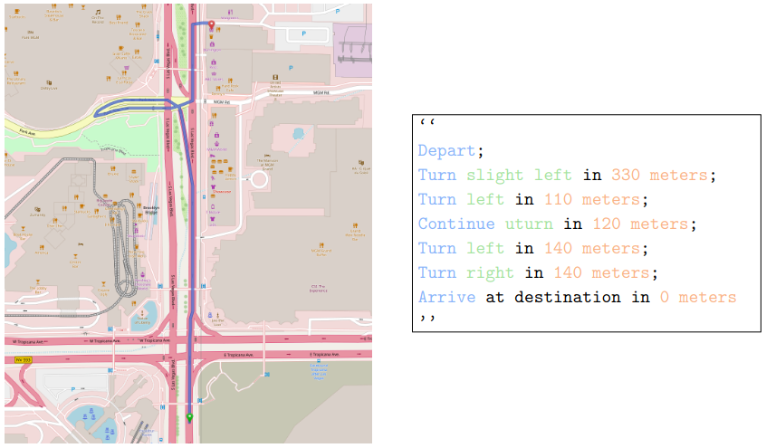

# route_description_generation

Builds natural-language driving-route datasets for [nuPlan](https://www.nuscenes.org/nuplan)
scenarios.

For each scenario the pipeline derives the route the ego **actually drove**, asks a local
[OSRM](https://project-osrm.org/) server for turn-by-turn directions along it, converts those into
a natural-language description, and writes the result to a JSONL file with a SQLite offset index
for O(1) lookup by scenario token.



## Aligning OSRM's route with the nuPlan Route

OSRM might describe a *different* route than the one driven. Each
candidate route is therefore checked on two independent axes — **length** agreement and
**geometric** agreement with the driven path — and only accepted when both hold. Length alone is
not enough: a route down a parallel street can match in length while describing the wrong road.

Note that there exist scenarios where the ego drove a route that is not routable in OSRM at all, e.g. due to OSRM edge projection mismatches or missing edges. In those cases the route is marked invalid and the description is omitted. 

## Prerequisites

- Python >= 3.9.12 and [uv](https://docs.astral.sh/uv/)
- nuPlan v1.1 data and maps, with `NUPLAN_DATA_ROOT` and `NUPLAN_MAPS_ROOT` exported
  (the CLI derives every path from these)
- A local OSRM server per map region (see [OSRM setup](#osrm-setup))

## Install

```bash
git clone git@github.com:KIT-MRT/nuplan-natural-language-routing-dataset.git
cd nuplan-natural-language-routing-dataset
uv sync
```

## Usage

The package installs a single `rdg` entry point.

```bash
uv run rdg --help
```

Commands, in the order a typical run uses them:

| Command               | Purpose                                                                    |
| --------------------- | -------------------------------------------------------------------------- |
| `rdg export-tokens`   | Collect scenario tokens from a directory of NPZ files, one per line        |
| `rdg build-dataset`   | Generate a routing dataset from nuPlan scenarios (the main command)        |
| `rdg prune-npz`       | Move NPZ files with invalid routes aside, and cap the remainder at a count |
| `rdg scenario-filter` | Emit a nuPlan `ScenarioFilter` YAML of scenarios with valid routes         |
| `rdg modify-dataset`  | Post-process an existing dataset in place, without re-running routing      |

Every command takes `--help` for its full option list.

### Quick start

Start the OSRM servers once, then build a split:

```bash
./scripts/start_osrm_servers.sh /path/to/osrm     # or export OSRM_DATA_DIR
uv run rdg build-dataset --split val14
```

That writes `datasets/val14_lg_routing_data.jsonl` and `datasets/val14_lg_routing_index.sqlite`.

Everything else is derived, so `--split` is normally the only option you pass:

| Derived           | From                                                                                               |
| ----------------- | -------------------------------------------------------------------------------------------------- |
| data path         | `$NUPLAN_DATA_ROOT/nuplan-v1.1/splits/` + **`trainval`** for train/val/val14, **`test`** otherwise |
| map path          | `$NUPLAN_MAPS_ROOT`                                                                                |
| output dir        | `./datasets`                                                                                       |
| log names         | `res/nuplan_{train,val,test}.json`                                                                 |
| scenario tokens   | `res/<split>_tokens.txt`, when the split ships one                                                 |
| extraction offset | **`-3.0` s** for val/val14/interplan, **`0.0` s** for train                                        |

That token row matters for `val14`: it shares `nuplan_val.json` with `val`, so the 1118-scenario
benchmark is defined by `res/val14_tokens.txt` rather than by log names.

### Extraction offset

nuPlan's simulation builders (`nuplan_challenge`, `nuplan_eval`) extract every scenario type at
`[15.0, -3.0]`, so a simulated planner's **iteration 0 is 3 s before the tagged token** — up to ~45 m
back, and in a different roadblock about a third of the time. The token itself is unaffected
(`scenario.token` stays the anchor), so only the *poses* move.

Splits consumed by simulation therefore default to `--extraction-offset -3.0`, which anchors
`route_start`, `route_roadblock_ids` and the goal where the planner actually begins. Training splits
stay at `0.0`, matching the pose their cached features are built from. Pass the flag explicitly to
override either way:

```bash
uv run rdg build-dataset --split val14                          # -3.0, matches simulation
uv run rdg build-dataset --split val14 --extraction-offset 0.0  # anchored at the token
```

`--data-path`, `--map-path`, `--output-dir` and `--scenario-tokens-file` override any of it.

```bash
uv run rdg build-dataset --split train --workers 24 --output-dir /data/routing
```

### Describing a route the ego did not drive

`build-dataset` derives each scenario's route from its driven trajectory, so it can only describe
what happened. `build-dataset-from-routes` takes the routes as input instead — one JSONL row per
route — which is what makes counterfactual routes describable: the alternative routes from
[`nucontrol`](https://github.com/marlon31415/nucontrol.git) / `nuscenario_generation`, or any other externally chosen route.

```bash
uv run rdg build-dataset-from-routes --routes alternative_routes.jsonl --output-dir /data/routing_alt
```

Each input row needs `source_token`, `route_roadblock_ids`, `goal_position` and `alt_token`
(`alt_index` and `instruction` are carried through when present). Rows are keyed by `alt_token`, so
several alternatives of one scenario can live in the same dataset without overwriting each other in
the index.

The reference path is the route's lane **centerline** rather than a driven trajectory — there is no
driven trajectory for a route nobody drove — which selects the `"centerline"` shape check in
`routing.PATH_CHECKS`. This is the same construction `flow_drive.planner.planner` uses at inference
time under `--alternative_routing`, so an offline dataset and the live planner describe a route the
same way.

Keep `--extraction-offset` equal to the value the routes were searched with: the ego pose the route
diverges from is the pose the description starts at.

### Pruning a training set

The usual loop is: export tokens from a directory of NPZ files, build a dataset from them, then
set aside the scenarios that came back invalid.

```bash
uv run rdg export-tokens --split train --npz-dataset-root /data/nuplan-flowdrive
uv run rdg build-dataset --split train
uv run rdg prune-npz --npz-dir /data/nuplan-npz/train \
                     --dataset datasets/train_lg_routing_data.jsonl --dry-run
```

Drop `--dry-run` to move invalid scenarios into `<npz-dir>/invalid/`. Add `--num-scenarios N` to
also cap what remains — a random excess goes to `<npz-dir>/surplus/`, chosen by `--seed` (default
`0`) so the split is reproducible:

```bash
uv run rdg prune-npz --npz-dir /data/nuplan-npz/train \
                     --dataset datasets/train_lg_routing_data.jsonl --num-scenarios 100000
```

Nothing is deleted, so a run can be undone by moving files back. Re-running is a no-op, and an
existing file of the same name is never overwritten. Progress is reported for each phase; pass
`--no-progress` to silence it.

### Restricting a simulation to valid routes

`rdg scenario-filter` turns a generated dataset into a nuPlan `ScenarioFilter` YAML containing
only the tokens whose route validated, so a simulation runs on exactly the scenarios that have a
usable description:

```bash
uv run rdg scenario-filter --input-jsonl datasets/val14_lg_routing_data.jsonl --template-yaml /scenario_filter/val14.yaml
```

By default it writes beside the input, named after the split — `val14_lg_routing_data.jsonl`
becomes `val14.yaml`. Pass `--output-yaml` to choose the path yourself.
To only replace an existing filter's token list, point at it with
`--template-yaml`; every other key and the file's formatting are preserved.

### Reading a dataset

```python
from route_description_generation.dataset_index import load_by_token

row = load_by_token("val14_lg_routing_index.sqlite", "val14_lg_routing_data.jsonl", token)
print(row["routing_data"]["route_description"])
```

`load_by_token` caches its file and connection handles per process, so it is safe to call from
PyTorch `DataLoader` workers with `persistent_workers=True`.

## Dataset format

One JSON object per line:

```jsonc
{
  "token": "...",
  "scenario_data": { "map_name": "...", "scenario_type": "..." },
  "routing_data": {
    "route_start": [x, y],              // map frame, see route_epsg
    "route_end": [x, y],
    "route_epsg": 32648,
    "route_roadblock_ids": ["..."],     // the connected route the ego drove
    "route_connectivity_gaps": [],      // pairs with no edge in the map graph
    "route_description": "Depart; Turn left in 170 meters; ...",
    "route_maneuver_positions": [[x, y], ...],
    "route_directions": { },            // raw OSRM response
    "valid_route": true,                // length_valid AND path_valid
    "route_validation": { },            // both checks, with their inputs
    "routing_strategy": "A_vias_start_proj"
  }
}
```

`valid_route` is the field to filter on. `route_validation` records *why*: `length_valid` compares
route lengths, `path_valid` compares geometry (`path_deviation_mean_m`), and both must hold.

## OSRM setup

One OSRM server per map region, on fixed ports keyed by nuPlan `map_name`:

| Map                                          | Region                    | Port |
| -------------------------------------------- | ------------------------- | ---- |
| `us-ma-boston`, `us-pa-pittsburgh-hazelwood` | us-northeast              | 5001 |
| `us-nv-las-vegas-strip`                      | us-west                   | 5002 |
| `sg-one-north`                               | malaysia-singapore-brunei | 5003 |

```bash
./scripts/setup_osrm.sh /path/to/save/osrm       # download, extract, partition, customise (Docker)
./scripts/start_osrm_servers.sh /path/to/osrm    # launch osrm-routed per region and wait for readiness
```
Use `start_osrm_servers_apptainer.sh` instead on hosts without root.

## Development

```bash
uv run pytest                  # unit tests only - no external data, runs in seconds
uv run pytest -m integration   # visual sanity check (needs data + a built dataset)
uv run ruff check .            # lint
uv run ruff format .           # format
```

`tests/test_visual_sanity.py` renders failing routes to `tests/output/` for inspection. It needs
`NUPLAN_DATA_ROOT` / `NUPLAN_MAPS_ROOT` and a pre-built dataset, so it is marked `integration` and
deselected by default.


## License

MIT — see [LICENSE](LICENSE).
